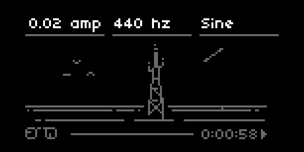
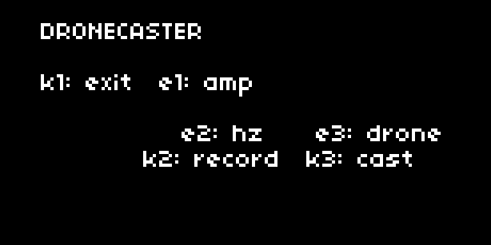

# dronecaster

# Installation

 1. Install via maiden or clone/download the repo to `dust/code`.
 2. Restart norns to pickup the SuperCollider Dronecaster engine.
 3. Drone!
 
# Contribute

We need more `SynthDefs`! Join the discussion on lines: https://l.llllllll.co/dronecaster
